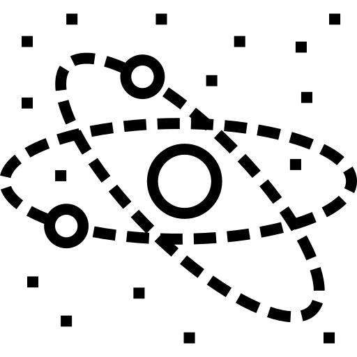

# **Parallax**

Parallax effect


Example:

```html
<!-- html -->
<div class="wrapper">
        
    <div class="parallax-item atom">  
        
    </div>

    <div class="parallax-item shooting-stars">
        
    </div>

    <div class="parallax-item planet">
        
    </div>
</div>
```

```js
// JS
let p = new Parallax({
    object: document.querySelectorAll('.parallax-item'),
    over: document.querySelector('.wrapper'),   
    aroundCenter: false,    
    index: [1.2, 0.8, 0.2, 0.5], 
}) 
```
